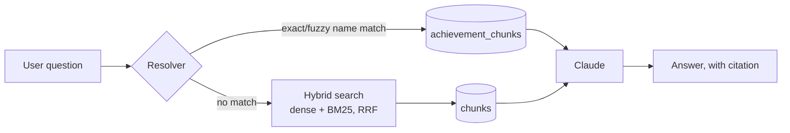

# Steam Achievement RAG

A retrieval-augmented generation system that answers **"how do I get this achievement?"** for *Halo: The Master Chief Collection* — built end to end from raw Steam API data to a cited, generated answer.


## Why this exists

Steam's own achievement data gives you a name and a one-line description at best — hidden achievements don't even get that. The actual *how-to* content lives in Steam Community Guides: user-written walkthroughs, phrased a dozen different ways, with no database column that captures any of it. That's a genuine fit for RAG rather than a plain SQL lookup.

The core idea driving the whole architecture: **resolve, don't retrieve.** Most questions name an achievement, or something close to it — that's a cheap, precise lookup against ~700 known names, not a search problem. Only genuinely vague questions ("the one where you kill the Elite with a plasma sword") need to fall through to embeddings and hybrid search. Measuring how many questions never leave the resolver is itself one of this project's findings.

## How it works



1. **Resolve** — check the question against 700 known achievement names, exact match first, then fuzzy. A hit pulls pre-linked guide chunks directly, no search involved.
2. **Search** — if nothing resolves, embed the question and run hybrid search: dense similarity (pgvector, MiniLM embeddings) combined with keyword ranking (Postgres full-text search) via Reciprocal Rank Fusion.
3. **Generate** — hand whatever chunks were found to Claude, which writes a short, direct answer and names the source guide — or says plainly that the guides don't cover it, rather than guessing.

## Data model

| Table | Purpose |
| --- | --- |
| `achievements` | All ~700 achievements: name, description, hidden flag, sub-game, global completion % |
| `guides` | Steam Community Guide metadata: title, author, vote count |
| `chunks` | Guide text split on real section boundaries, with a dense embedding (`vector(384)`) and a `tsvector` for keyword search |
| `achievement_chunks` | The bootstrap linking achievements to the chunks that explain them — built by matching achievement names *and* descriptions against guide text, not hand-labeled |

## Tech stack

- **Python** — every stage of the pipeline
- **PostgreSQL 17 + [pgvector](https://github.com/pgvector/pgvector)** — one database for structured metadata, full-text search, and vector similarity; no separate vector store
- **[sentence-transformers](https://www.sbert.net/)** (`all-MiniLM-L6-v2`, 384-dim) — local embeddings, no API calls needed for the retrieval side
- **[Anthropic Claude API](https://docs.claude.com/)** — grounded answer generation
- **Steam Web API** (`ISteamUserStats`, `IPublishedFileService`) — achievement schema and Community Guide content
- **Docker Compose + [Dev Containers](https://containers.dev/)** — a fully reproducible environment; the database is rebuilt from committed files, never hand-configured

## Results

Measured against a 100-question gold set (a mix of exact achievement names, natural rephrasing, and vague descriptions), scored two ways:

| | Overall | Exact-name questions | Rephrased | Vague |
| --- | --- | --- | --- | --- |
| **Resolver alone** (name-matching only) | 45% | 98% | 3% | 0% |
| **Resolver + hybrid search** | 90% | 100% | 82% | 81% |

The resolver-alone baseline is the control: it shows the system correctly recognizing what it *can't* answer by name alone, rather than guessing — the gap between the two rows is the actual, measured value hybrid search adds. All figures come from `eval/metrics.py`, re-runnable against the current database at any time.

## Repo layout

```text
ingest/       Capture raw Steam API responses to JSON — no parsing here on purpose,
              so the parser can be rewritten without re-hitting the API
transform/    Parse sub-games, clean and chunk guide text, link chunks to achievements
index/        Schema (DDL) and the embedding/full-text indexing step
retrieve/     Resolver, hybrid search, and the resolve→search→generate pipeline
eval/         The gold-set questions and the scoring script
```

## Getting started

**Prerequisites:** [Docker Desktop](https://www.docker.com/products/docker-desktop/), VS Code with the [Dev Containers extension](https://marketplace.visualstudio.com/items?itemName=ms-vscode-remote.remote-containers), a [Steam Web API key](https://steamcommunity.com/dev/apikey), and an [Anthropic API key](https://console.anthropic.com/).

1. Clone the repo and copy the env template:
   ```bash
   cp .env.example .env
   ```
2. Fill in `.env` with your own keys:
   ```text
   STEAM_API_KEY=...
   ANTHROPIC_API_KEY=...
   ```
3. Open the folder in VS Code → **Dev Containers: Reopen in Container**. This builds a Python container networked with a `pgvector/pgvector:pg17` Postgres container, with your `.env` values injected automatically.
4. Apply the schema:
   ```bash
   psql "$DATABASE_URL" -f index/schema.sql
   ```

## Running the pipeline

Each stage is independently re-runnable — re-chunking doesn't mean re-fetching from Steam, and re-linking doesn't mean re-embedding.

```bash
# 1. Capture raw data from the Steam API (committed to ingest/cache/, not parsed)
python ingest/achievements.py
python ingest/guides.py

# 2. Parse, clean, chunk, and link
python transform/parse_subgame.py
python transform/chunk.py
python transform/link.py

# 3. Build the search index (embeddings + full-text)
python index/embed.py

# 4. Ask a question
python retrieve/generate.py

# 5. Score the system against the gold set
python eval/metrics.py
```

## Notable design decisions

A few things worth knowing if you're reading the code, not just running it:

- **Structure-aware chunking, not fixed-size splitting.** Guides are split on their real section boundaries, and sections that bundle several achievements under one heading (a compilation-style FAQ format some guides use) get split further into one chunk per achievement — a fixed-size chunker would have diluted the retrieval signal for exactly this content.
- **Two-pass achievement linking.** Most achievements link to guide content by exact display-name match. The remainder — achievements with joke/flavor-text names a guide author would never write verbatim ("Bip! Bap! BAM!") — link by matching the achievement's own *description* text instead, confirmed by checking that the description genuinely does appear in the corpus before trusting the technique.
- **Reciprocal Rank Fusion, not a raw score blend.** Cosine similarity and BM25 scores live on incompatible scales; combining them by rank position instead of raw magnitude avoids one silently dominating the other.
- **Generation is grounded and refusal-capable.** The system prompt requires citing the source guide and explicitly permits — and expects — "the guides don't say" over a plausible-sounding guess.
- **Non-English guides are filtered at load time**, not ingest time — the raw capture keeps everything, and the language filter lives in the parsing stage so the decision can change without re-hitting the API.

## Disclaimer

This is an unofficial, fan-made project for portfolio/educational purposes. It is not affiliated with, endorsed by, or sponsored by Microsoft, 343 Industries, or Valve. *Halo* and *Halo: The Master Chief Collection* are trademarks of Microsoft Corporation. All achievement data and guide content is retrieved live from Steam's public Web API and Steam Community Guides, respectively.

## License

[MIT](LICENSE)
